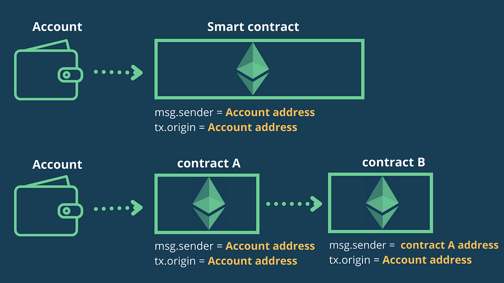
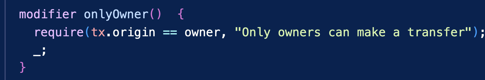
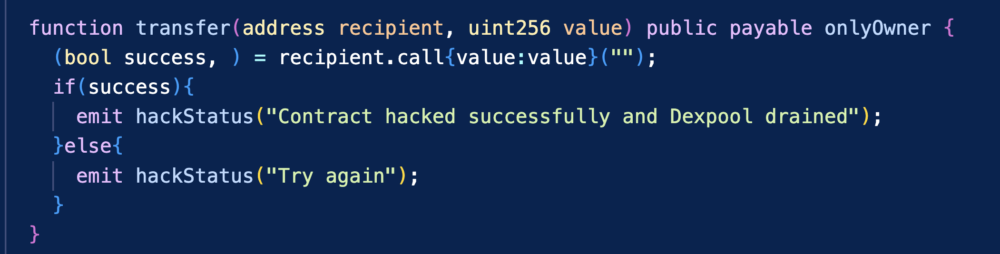

# Tx.origin Phishing Attacks in Solidity Smart Contracts🥷🏽

This repository contains code and an exploit that demonstrates how vulnerable Solidity smart contracts are to using tx.origin phishing for verification.

## What is tx.origin, What is msg.sender?🤔
Both `tx.origin` and `msg.sender` are global variables in Solidity. They are used to refer to the address of the sender of a transaction. However, there is a difference between the two.

`msg.sender`: Refers to the address of an account or a smart contract which is directly calling a smart contract's function.

`tx.origin`: Refers to the address of an account which is calling a smart contract's function, only account address can be tx.origin.

## How does this phishing attack work?🤷🏼

A phishing attack using tx.origin works by tricking the victim into sending a transaction to a malicious contract. 

Once a txn has been sent to the malicious contract which is `./Attacker.sol` in this context, the `receiver` function which contains a transfer function will be called

The authentication will be successful because the `tx.origin` is the victim's address.

The malicious contract will call the `transfer` function which will transfer the funds to the attacker's address.

## How to protect your contracts from phishing attacks

There are a few ways to protect your contracts from phishing attacks. One way is to use a different variable to verify the identity of the sender of a transaction. Another way is to use a library that has been designed to protect against phishing attacks.

## Code and exploit

The code and exploit for this repository can be found in the `/code` directory. The code is a simple Solidity contract that demonstrates how a phishing attack can be launched. The exploit is a script that can be used to test the contract and see how it is vulnerable to phishing attacks.

## Resources

* [Understanding Phishing with tx.origin in Solidity](https://www.infuy.com/blog/understanding-phishing-with-tx-origin-in-solidity/)
* [Issues with Authorization Using tx.origin](https://neptunemutual.com/blog/issues-with-authorization-using-txorigin/)
* [Solidity: Tx Origin Attacks](https://medium.com/coinmonks/solidity-tx-origin-attacks-58211ad95514)

## Contributing

This repository is open source and contributions are welcome. If you find any bugs in the code or have any suggestions for improvement, please feel free to open an issue or submit a pull request.

## License

This repository is licensed under the MIT License.
